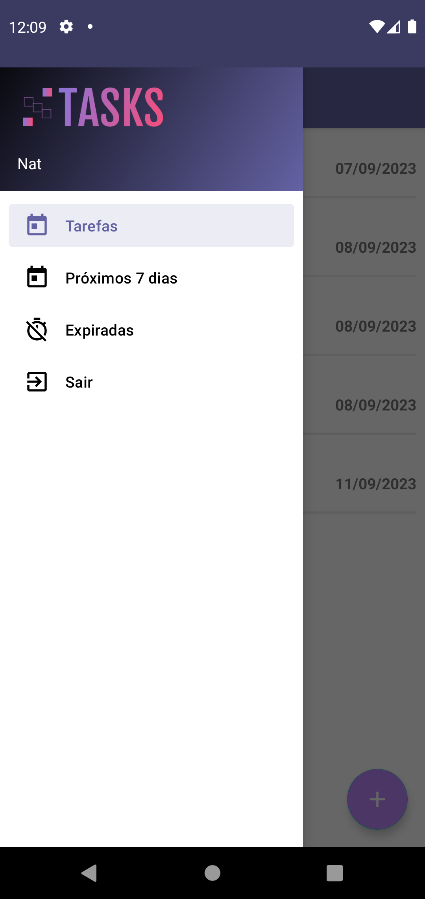
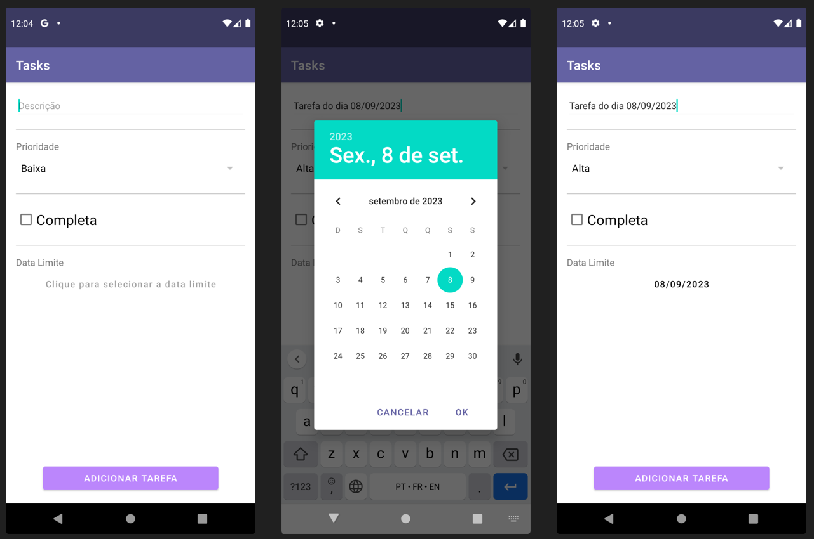
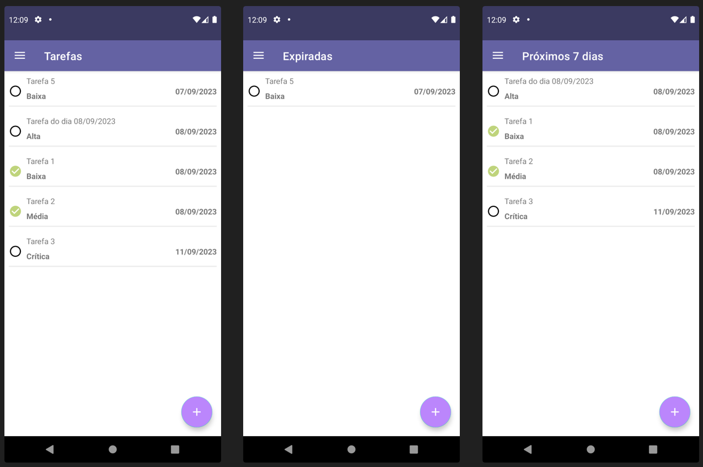

## Tasks-app-android

### 📄 Descrição:

Aplicativo Android com Kotlin, composto por mais de 5 telas, que cria e gerencia tarefas.  
As tarefas são criadas com uma descrição/título, recebem um grau de prioridade (Baixa, Média, Alta ou Crítica) e uma data limite, e podem ser marcadas como completas ou não.   
Foi desenvolvido com Android SDK, RecyclerView, Clean Architecture e Arq. MVVM, Room e Retrofit.

##

### 📲 Layout:

- tela do menu lateral:
<h1>
  
</h1>
 

- telas que mostram o passo-a-passo para a inserção de uma nova tarefa:
<h1>
  
</h1>
 

- telas que mostram todas as opções de tarefas:
<h1>
  
</h1>

### 📍 Autora:

- NATHÁLIA MIRIAM
- LinkedIn: https://www.linkedin.com/in/nathaliamiriam/
- Portfólio: https://nathaliamiriam.github.io/
